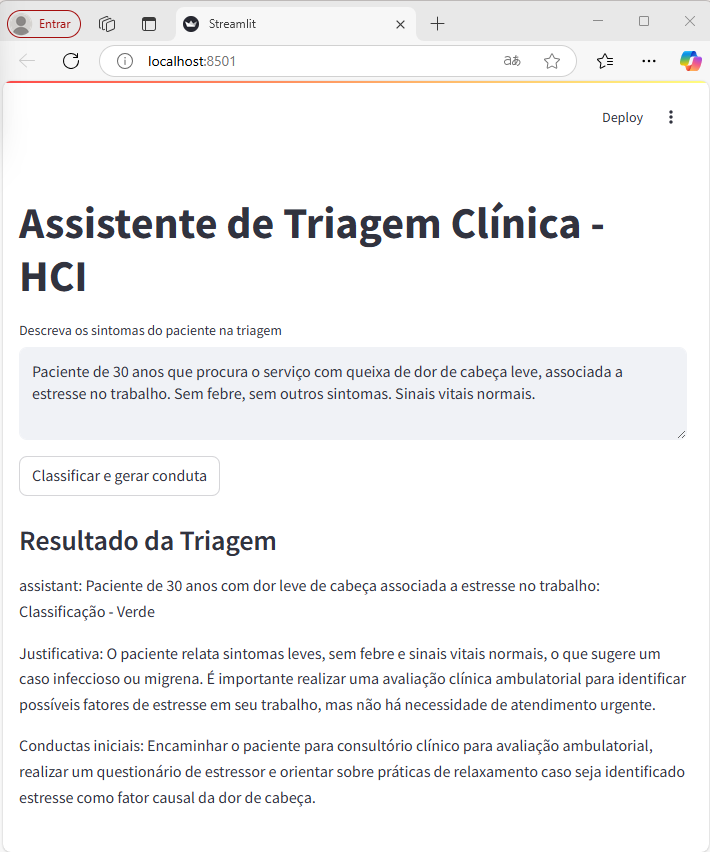

# Assistente de IA para Triagem Clínica

Este projeto implementa um assistente de IA com interface web para triagem clínica automatizada, utilizando **embeddings semânticos**, **banco vetorial (ChromaDB)** e um **modelo local (Mistral via Ollama)**.

---

## Visão Geral

O assistente recebe **sintomas clínicos** como entrada, busca **casos semelhantes** em um banco vetorial e classifica o paciente conforme o **Protocolo de Manchester**, fornecendo também **condutas iniciais**.

### Funcionamento geral do assistente


### Cores e classificações do Protocolo de Manchester


---

## Pré-requisitos

- **Sistema operacional:** Windows 10 ou superior  
- **Memória RAM recomendada:** 8 GB ou mais  
- **Espaço em disco:** 10 GB ou mais  

---

## Etapas de Instalação

### 1. Instalar o Ollama

> O Ollama roda modelos LLM localmente. Requer suporte à virtualização.

- Baixe: [https://ollama.com/download](https://ollama.com/download)
- Após a instalação, teste no terminal:

```bash
ollama list
```

---

### 2. Baixar o modelo `mistral`

```bash
ollama pull mistral
```

> Obs.: O modelo `llama3` pode exigir mais memória RAM.

---

### 3. Instalar Python 3.10.x

- Baixe: [Python 3.10.11](https://www.python.org/ftp/python/3.10.11/python-3.10.11-amd64.exe)
- Marque a opção **Add Python to PATH**
- Verifique a versão instalada:

```bash
python --version
```

---

### 4. Criar ambiente virtual

```powershell
cd "C:\Users\SEU_USUARIO\Documents\Projetos\AgenteIA"
python -m venv venv310
.\venv310\Scripts\Activate.ps1
```

---

### 5. Instalar dependências

```bash
pip install --upgrade pip
pip install streamlit
pip install llama-index
pip install chromadb
pip install sentence-transformers
pip install nest_asyncio
pip install torch torchvision torchaudio --index-url https://download.pytorch.org/whl/cu118
```

---

### 6. Criar os arquivos

- `app.py` ou `app-bd.py`: script principal da aplicação.
- `casos.txt`: arquivo com casos simulados de triagem clínica (um por linha).

---

## Executar o Aplicativo

```powershell
streamlit run app.py
```

Abra o navegador em:

[http://localhost:8501](http://localhost:8501)

---

## Interface Esperada

- Campo para **descrição dos sintomas**
- Botão **“Classificar e gerar conduta”**
- Resultado com:
  - **Classificação de risco**
  - **Justificativa clínica**
  - **Condutas iniciais recomendadas**

#### Exemplo da interface em execução:



---

## Visualizar dados com DB Browser for SQLite

1. Baixe: [https://sqlitebrowser.org](https://sqlitebrowser.org)
2. Abra o diretório `./chroma_db/`
3. Execute consultas SQL como:

```sql
SELECT * FROM collections;
SELECT * FROM embeddings;
SELECT * FROM embeddings_queue;
```

---

## Exemplos de Casos Armazenados

```text
case_0: Paciente do sexo masculino, 58 anos, com dor torácica intensa...
case_7: Paciente com falta de ar aos mínimos esforços, tosse produtiva...
case_15: Paciente com dispneia súbita, cianose e confusão...
case_19: Paciente com perda súbita de força no braço esquerdo...
```

---

## Links Úteis

- [LlamaIndex](https://docs.llamaindex.ai/en/stable/)
- [ChromaDB](https://docs.trychroma.com/)
- [Ollama](https://ollama.com/)
- [Streamlit](https://streamlit.io/)
